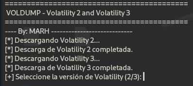
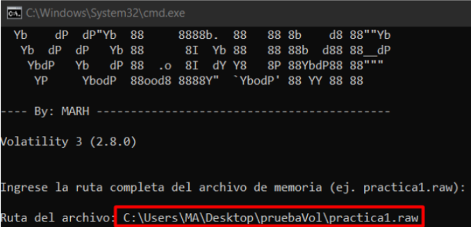
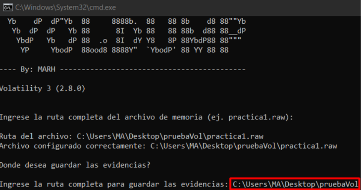
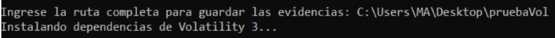
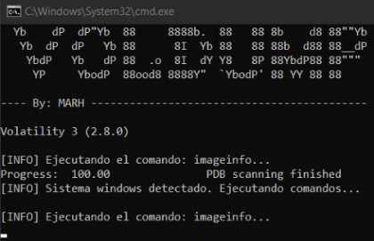
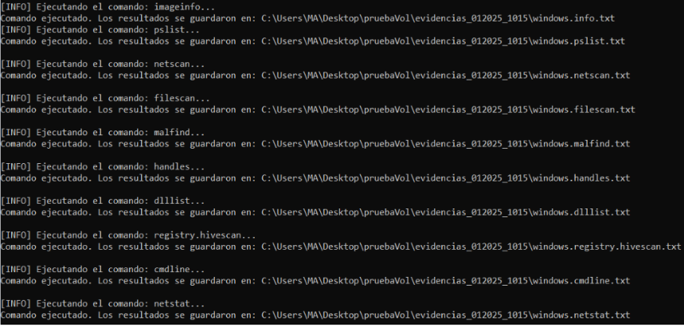
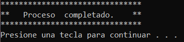

#🔎💾 VolDump

Este script de procesamiento automatizado está diseñado para ejecutar una serie de comandos de análisis forense de memoria utilizando la herramienta Volatility 3 (Versión 2.8.0). El script detecta automáticamente el sistema operativo del volcado de memoria (Windows o Linux) y ejecuta una serie de comandos específicos para cada plataforma. Además, guarda los resultados en archivos de texto organizados en una carpeta de salida.

# Como utilizar VolDump

⚠️ Para utilizar este script simplemente debemos hacer click derecho y ejecutarlo con permisos de administrador.

Acto seguido nos pedirá la ruta donde se almacena el archivo con las evidencias

Despues nos pedirá la ruta donde se guardarán las evidencias obtenidas por el sript

Ahora se instalarán todas las dependecias necesarias de manera automática

Una vez completado ese proceso se ejecutarán todos los comandos disponibles de Volatility 3

Y una vez completado el proceso por completo veremos lo siguiente: 
 

