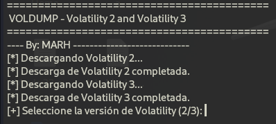

# VolDump

VolDump es un frontend en Bash para automatizar análisis forenses de memoria con **Volatility 3**. Está pensado para ejecutarse en **Linux**, preparar el entorno si faltan dependencias y lanzar una batería de plugins útiles sobre volcados de memoria de **Windows o Linux**.



## Qué hace

- Verifica `python3`, `pip` y `volatility3`.
- Intenta instalar dependencias automáticamente con el gestor disponible en el sistema.
- Funciona como asistente interactivo.
- Detecta automáticamente si el volcado es de Windows o Linux.
- Pregunta al usuario qué quiere extraer y ejecuta solo esa selección.
- Organiza la salida por categorías: `general`, `procesos`, `red`, `modulos`, `malware`, etc.
- Genera `log`, `resumen.txt` y `reporte.md` al terminar.
- Incluye un modo opcional para analizar memoria en vivo desde `/proc/kcore` en Linux.

## Compatibilidad real

- Sistema anfitrión soportado: **Linux**
- Volcados soportados: **Windows** y **Linux**
- Análisis de memoria en vivo: **solo Linux y ejecutando como root**

El proyecto no está diseñado para ejecutarse directamente en Windows.

## Requisitos

- Linux
- Bash
- Python 3.8 o superior
- `sudo` o root
- Un gestor de paquetes compatible si quieres instalación automática de dependencias

Gestores soportados para la instalación automática:

- `apt-get`
- `dnf`
- `yum`
- `pacman`
- `zypper`
- `apk`
- `microdnf`

## Instalación

```bash
git clone https://github.com/Mayky23/VolDump.git
cd VolDump
chmod +x VolDump.sh
```

## Uso

```bash
./VolDump.sh
```

## Flujo de trabajo

1. El script comprueba dependencias y prepara el directorio de evidencias.
2. Si faltan `python3`, `pip` o `volatility3`, intenta instalarlos automáticamente.
3. Pregunta si quieres analizar un volcado de memoria o la memoria en vivo del sistema.
4. Si eliges un volcado, te pide la ruta y detecta si es Windows o Linux.
5. Muestra las categorías de extracción disponibles.
6. El usuario selecciona una o varias opciones.
7. VolDump ejecuta los plugins correspondientes y genera el reporte final.

### Ejemplo de selección

Según el sistema detectado, el script ofrece opciones como:

- Información general
- Procesos y actividad
- Módulos
- Red
- Archivos
- Registro y persistencia
- Malware
- Todo

La selección se hace escribiendo los números de las opciones separados por comas.

## Estructura de salida

Cada ejecución crea un directorio de evidencias, por ejemplo:

```text
evidencias_20260407_163000/
├── logs/
│   └── voldump.log
├── memoria/
│   ├── general/
│   ├── procesos/
│   ├── red/
│   └── ...
├── sistema/
├── reporte.md
└── resumen.txt
```

### Archivos generados

- `logs/voldump.log`: detalle de ejecución.
- `resumen.txt`: resumen técnico con plugins correctos y fallidos.
- `reporte.md`: reporte final listo para revisar o adjuntar.

## Plugins incluidos

### Para volcados de Windows

- `windows.info`
- `windows.pslist`
- `windows.psscan`
- `windows.pstree`
- `windows.cmdline`
- `windows.dlllist`
- `windows.handles`
- `windows.netscan`
- `windows.modules`
- `windows.svcscan`
- `windows.filescan`
- `windows.registry.printkey`
- `windows.malfind`

### Para volcados de Linux

- `linux.info`
- `linux.pslist`
- `linux.psscan`
- `linux.pstree`
- `linux.psaux`
- `linux.bash`
- `linux.lsof`
- `linux.lsmod`
- `linux.netfilter`
- `linux.mountinfo`
- `linux.kmsg`
- `linux.check_syscall`

## Limitaciones

- No reemplaza el análisis manual ni la interpretación forense de resultados.
- Algunos plugins pueden fallar si faltan símbolos, perfiles o si la imagen está dañada.
- El modo en vivo basado en `/proc/kcore` depende mucho de la configuración del kernel.
- Si el sistema no tiene ninguno de los gestores soportados y `ensurepip` no está disponible, la preparación automática puede no completarse.

